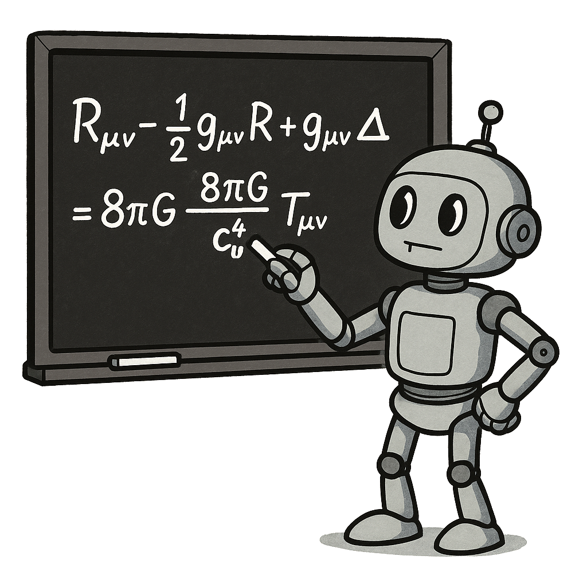

<div align="center">
  
</div>

# Symbolic Algebra MCP Server

Sympy-MCP is a Model Context Protocol server for allowing LLMs to autonomously perform symbolic mathematics and computer algebra. It exposes numerous tools from SymPy's core functionality to MCP clients for manipulating mathematical expressions and equations.

<a href="https://glama.ai/mcp/servers/@sdiehl/sympy-mcp">
  
</a>

## Why?

Language models are absolutely abysmal at symbolic manipulation. They hallucinate variables, make up random constants, permute terms and generally make a mess. But we have computer algebra systems specifically built for symbolic manipulation, so we can use tool-calling to orchestrate a sequence of transforms so that the symbolic kernel does all the heavy lifting.

While you can certainly have an LLM generate Mathematica or Python code, if you want to use the LLM as an agent or on-the-fly calculator, it's a better experience to use the MCP server and expose the symbolic tools directly.

The server exposes a subset of symbolic mathematics capabilities including algebraic equation solving, integration and differentiation, vector calculus, tensor calculus for general relativity, and both ordinary and partial differential equations. 

For example, you can ask it in natural language to solve a differential equation:

> Solve the damped harmonic oscillator with forcing term: the mass-spring-damper system described by the differential equation where m is mass, c is the damping coefficient, k is the spring constant, and F(t) is an external force.

$$ m\frac{d^2x}{dt^2} + c\frac{dx}{dt} + kx = F(t) $$

Or involving general relativity:

> Compute the trace of the Ricci tensor $R_{\mu\nu}$ using the inverse metric $g^{\mu\nu}$ for Anti-de Sitter spacetime to determine its constant scalar curvature $R$.

## Usage

You need [uv](https://docs.astral.sh/uv/getting-started/installation/) first.

- **Homebrew** : `brew install uv`
- **Curl** : `curl -LsSf https://astral.sh/uv/install.sh | sh`

Then you can install and run the server with the following commands:

```shell
# Setup the project
git clone https://github.com/sdiehl/sympy-mcp.git
cd sympy-mcp
uv sync

# Install the server to Claude Desktop
uv run mcp install server.py

# Run the server
uv run mcp run server.py
```

You should see the server available in the Claude Desktop app now. For other clients, see below.

If you want a completely standalone version that just runs with a single command, you can use the following. *Note this is running arbitrary code from Github, so be careful.*

```shell
uv run --with https://github.com/sdiehl/sympy-mcp/releases/download/0.1/sympy_mcp-0.1.0-py3-none-any.whl python server.py
```

If you want to do general relativity calculations, you need to install the [`einsteinpy`](https://github.com/einsteinpy/einsteinpy) library.

```shell
uv sync --group relativity
```

## Available Tools

The sympy-mcp server provides the following tools for symbolic mathematics:

| Tool | Tool ID | Description |
|------|-------|-------------|
| Variable Introduction | `intro` | Introduces a variable with specified assumptions and stores it |
| Multiple Variables | `intro_many` | Introduces multiple variables with specified assumptions simultaneously |
| Expression Parser | `introduce_expression` | Parses an expression string using available local variables and stores it |
| LaTeX Printer | `print_latex_expression` | Prints a stored expression in LaTeX format, along with variable assumptions |
| Algebraic Solver | `solve_algebraically` | Solves an equation algebraically for a given variable over a given domain |
| Linear Solver | `solve_linear_system` | Solves a system of linear equations |
| Nonlinear Solver | `solve_nonlinear_system` | Solves a system of nonlinear equations |
| Function Variable | `introduce_function` | Introduces a function variable for use in differential equations |
| ODE Solver | `dsolve_ode` | Solves an ordinary differential equation |
| PDE Solver | `pdsolve_pde` | Solves a partial differential equation |
| Standard Metric | `create_predefined_metric` | Creates a predefined spacetime metric (e.g. Schwarzschild, Kerr, Minkowski) |
| Metric Search | `search_predefined_metrics` | Searches available predefined metrics |
| Tensor Calculator | `calculate_tensor` | Calculates tensors from a metric (Ricci, Einstein, Weyl tensors) |
| Custom Metric | `create_custom_metric` | Creates a custom metric tensor from provided components and symbols |
| Tensor LaTeX | `print_latex_tensor` | Prints a stored tensor expression in LaTeX format |
| Simplifier | `simplify_expression` | Simplifies a mathematical expression using SymPy's canonicalize function |
| Substitution | `substitute_expression` | Substitutes a variable with an expression in another expression |
| Integration | `integrate_expression` | Integrates an expression with respect to a variable |
| Differentiation | `differentiate_expression` | Differentiates an expression with respect to a variable |
| Coordinates | `create_coordinate_system` | Creates a 3D coordinate system for vector calculus operations |
| Vector Field | `create_vector_field` | Creates a vector field in the specified coordinate system |
| Curl | `calculate_curl` | Calculates the curl of a vector field |
| Divergence | `calculate_divergence` | Calculates the divergence of a vector field |
| Gradient | `calculate_gradient` | Calculates the gradient of a scalar field |
| Unit Converter | `convert_to_units` | Converts a quantity to given target units |
| Unit Simplifier | `quantity_simplify_units` | Simplifies a quantity with units |
| Matrix Creator | `create_matrix` | Creates a SymPy matrix from the provided data |
| Determinant | `matrix_determinant` | Calculates the determinant of a matrix |
| Matrix Inverse | `matrix_inverse` | Calculates the inverse of a matrix |
| Eigenvalues | `matrix_eigenvalues` | Calculates the eigenvalues of a matrix |
| Eigenvectors | `matrix_eigenvectors` | Calculates the eigenvectors of a matrix |

By default variables are predefined with assumptions (similar to how the [symbols()](https://docs.sympy.org/latest/modules/core.html#sympy.core.symbol.symbols) function works in SymPy). Unless otherwise specified the defaut assumptions is that a variable is complex, commutative, term over the complex field $\mathbb{C}$.

| Property | Value |
|----------|-------|
| `commutative` | true |
| `complex` | true |
| `finite` | true |
| `infinite` | false |

## Claude Desktop Setup

Normally the `mcp install` command will automatically add the server to the `claude_desktop_config.json` file. If it doesn't you need to find the config file and add the following:

* macOS: `~/Library/Application Support/Claude/claude_desktop_config.json`
* Windows: `%APPDATA%\Claude\claude_desktop_config.json`

Add the following to the `mcpServers` object, replacing `/ABSOLUTE_PATH_TO_SYMPY_MCP/server.py` with the absolute path to the sympy-mcp `server.py` file.

```json
{
  "mcpServers": {
    "sympy-mcp": {
      "command": "/opt/homebrew/bin/uv",
      "args": [
        "run",
        "--with",
        "einsteinpy",
        "--with",
        "mcp[cli]",
        "--with",
        "pydantic",
        "--with",
        "sympy",
        "mcp",
        "run",
        "/ABSOLUTE_PATH_TO_SYMPY_MCP/server.py"
      ]
    }
  }
}
```

## Cursor Setup

In your `~/.cursor/mcp.json`, add the following, where `ABSOLUTE_PATH_TO_SYMPY_MCP` is the path to the sympy-mcp server.py file.

```json
{
  "mcpServers": {
    "sympy-mcp": {
      "command": "/opt/homebrew/bin/uv",
      "args": [
        "run",
        "--with",
        "einsteinpy",
        "--with",
        "mcp[cli]",
        "--with",
        "pydantic",
        "--with",
        "sympy",
        "mcp",
        "run",
        "/ABSOLUTE_PATH_TO_SYMPY_MCP/server.py"
      ]
    }
  }
}
```

## VS Code Setup

VS Code and VS Code Insiders now support MCPs in [agent mode](https://code.visualstudio.com/blogs/2025/04/07/agentMode). For VS Code, you may need to enable `Chat > Agent: Enable` in the settings.

1. **One-click Setup:**

[](https://insiders.vscode.dev/redirect/mcp/install?name=sympy-mcp&config=%7B%22command%22%3A%22docker%22%2C%22args%22%3A%5B%22run%22%2C%22-i%22%2C%22-p%22%2C%228081%3A8081%22%2C%22--rm%22%2C%22ghcr.io%2Fsdiehl%2Fsympy-mcp%3Alatest%22%5D%7D)

[](https://insiders.vscode.dev/redirect/mcp/install?name=sympy-mcp&config=%7B%22command%22%3A%22docker%22%2C%22args%22%3A%5B%22run%22%2C%22-i%22%2C%22-p%22%2C%228081%3A8081%22%2C%22--rm%22%2C%22ghcr.io%2Fsdiehl%2Fsympy-mcp%3Alatest%22%5D%7D&quality=insiders)

OR manually add the config to your `settings.json` (global):

```json
{
  "mcp": {
    "servers": {
      "sympy-mcp": {
        "command": "uv",
        "args": [
          "run",
          "--with",
          "einsteinpy",
          "--with",
          "mcp[cli]",
          "--with",
          "pydantic",
          "--with",
          "sympy",
          "mcp",
          "run",
          "/ABSOLUTE_PATH_TO_SYMPY_MCP/server.py"
        ]
      }
    }
  }
}
```

2. Click "Start" above the server config switch to agent mode in the chat, and try commands like "integrate x^2" or "solve x^2 = 1" to get started.

## Cline Setup

To use with [Cline](https://cline.bot/), you need to manually run the MCP server first using the commands in the "Usage" section. Once the MCP server is running, open Cline and select "MCP Servers" at the top.

Then select "Remote Servers" and add the following:

- Server Name: `sympy-mcp`
- Server URL: `http://127.0.0.1:8081/sse`

## 5ire Setup

Another MCP client that supports multiple models (o3, o4-mini, DeepSeek-R1, etc.) on the backend is 5ire.

To set up with [5ire](https://github.com/nanbingxyz/5ire), open 5ire and go to Tools -> New and set the following configurations:

- Tool Key: `sympy-mcp`
- Name: SymPy MCP
- Command: `/opt/homebrew/bin/uv run --with einsteinpy --with mcp[cli] --with pydantic --with sympy mcp run /ABSOLUTE_PATH_TO/server.py`

Replace `/ABSOLUTE_PATH_TO/server.py` with the actual path to your sympy-mcp server.py file.

## Running in Container

You can build and run the server using Docker locally:

```bash
# Build the Docker image
docker build -t sympy-mcp .

# Run the Docker container
docker run -p 8081:8081 sympy-mcp
```

Alternatively, you can pull the pre-built image from GitHub Container Registry:

```bash
# Pull the latest image
docker pull ghcr.io/sdiehl/sympy-mcp:latest

# Run the container
docker run -p 8081:8081 --rm ghcr.io/sdiehl/sympy-mcp:latest
```

To configure Claude Desktop to launch the Docker container, edit your `claude_desktop_config.json` file:

```json
{
  "mcpServers": {
    "sympy-mcp": {
      "command": "docker",
      "args": [
        "run",
        "-i",
        "-p",
        "8081:8081",
        "--rm",
        "sympy-mcp"
      ]
    }
  }
}
```

Or to use the pre-built container from GitHub:

```json
{
  "mcpServers": {
    "sympy-mcp": {
      "command": "docker",
      "args": [
        "run",
        "-i",
        "-p",
        "8081:8081",
        "--rm",
        "ghcr.io/sdiehl/sympy-mcp:latest"
      ]
    }
  }
}
```

This configuration tells Claude Desktop to launch the Docker container when needed. Make sure to build the Docker image (`docker build -t sympy-mcp .`) before using Claude Desktop with this configuration.

The other installation methods can also be adapted to work with Docker if you change the uv command to use the docker run command instead.

## Example Interaction 1 : Differential Equations

Here's an example of how the tool-calling works in a conversation with an AI assistant using this MCP server:

**User**: Solve the damped harmonic oscillator with forcing term: the mass-spring-damper system described by the differential equation where m is mass, c is the damping coefficient, k is the spring constant, and F(t) is an external force.

$$ m\frac{d^2x}{dt^2} + c\frac{dx}{dt} + kx = F(t) $$

**Assistant**: (Internal tool call) `intro_many` to introduce variables:
```json
{
  "variables": [
    {"var_name": "t", "pos_assumptions": ["real"], "neg_assumptions": []},
    {"var_name": "m", "pos_assumptions": ["real", "positive"], "neg_assumptions": []},
    {"var_name": "c", "pos_assumptions": ["real", "positive"], "neg_assumptions": []},
    {"var_name": "k", "pos_assumptions": ["real", "positive"], "neg_assumptions": []}
  ]
}
```

**Assistant**: (Internal tool call) `introduce_function` to define x(t):
```json
{
  "func_name": "x"
}
```

**Assistant**: (Internal tool call) `introduce_expression` to create the differential equation:
```json
{
  "expr_str": "Eq(m*Derivative(x(t), t, t) + c*Derivative(x(t), t) + k*x(t), F(t))"
}
```

**Assistant**: (Internal tool call) `print_latex_expression` to display the equation nicely:
```json
{
  "expr_key": "expr_12"
}
```

Result:

$$
c \frac{d}{d t} x{\left(t \right)} + k x{\left(t \right)} + m \frac{d^{2}}{d t^{2}} x{\left(t \right)} = F{\left(t \right)}
$$

**Assistant**: (Internal tool call) `introduce_function` to define F(t):
```json
{
  "func_name": "F"
}
```

**Assistant**: (Internal tool call) `dsolve_ode` to solve the differential equation:
```json
{
  "expr_key": "expr_12",
  "func_name": "x"
}
```

Result:

$$
x{\left(t \right)} = C_{1} e^{\frac{t \left(- c + \sqrt{c^{2} - 4 k m}\right)}{2 m}} + C_{2} e^{- \frac{t \left(c + \sqrt{c^{2} - 4 k m}\right)}{2 m}} + \cdots
$$

## Example Interaction 2: General Relativity

**User**: Compute the trace of the Ricci tensor $R_{\mu\nu}$ using the inverse metric $g^{\mu\nu}$ for Anti-de Sitter spacetime to determine its constant scalar curvature $R$.

**Assistant**: (Internal tool call) `create_predefined_metric` to create the Anti-de Sitter metric:
```json
{
  "metric_name": "AntiDeSitter"
}
```

**Assistant**: (Internal tool call) `calculate_tensor` to calculate the Ricci tensor:
```json
{
  "metric_key": "metric_AntiDeSitter",
  "tensor_type": "RICCI_TENSOR",
  "simplify_result": true
}
```

**Assistant**: (Internal tool call) `print_latex_tensor` to display the Ricci tensor:
```json
{
  "tensor_key": "riccitensor_metric_AntiDeSitter"
}
```

Result:

$$
\left[\begin{matrix}3 & 0 & 0 & 0\\\\0 & - 3 \cos^{2}{\left(t \right)} & 0 & 0\\\\0 & 0 & - 3 \cos^{2}{\left(t \right)} \sinh^{2}{\left(\chi \right)} & 0\\\\0 & 0 & 0 & - 3 \sin^{2}{\left(\theta \right)} \cos^{2}{\left(t \right)} \sinh^{2}{\left(\chi \right)}\end{matrix}\right]
$$

**Assistant**: (Internal tool call) `calculate_tensor` to calculate the Ricci scalar:
```json
{
  "metric_key": "metric_AntiDeSitter",
  "tensor_type": "RICCI_SCALAR",
  "simplify_result": true
}
```

**Assistant**: (Internal tool call) `print_latex_tensor` to display the Ricci scalar:
```json
{
  "tensor_key": "ricciscalar_metric_AntiDeSitter"
}
```

Result:

$$
-12
$$

## Security Disclaimer

This server runs on your computer and gives the language model access to run Python logic. Notably it uses Sympy's `parse_expr` to parse mathematical expressions, which is uses `eval` under the hood, effectively allowing arbitrary code execution. By running the server, you are trusting the code that Claude generates. Running in the Docker image is slightly safer, but it's still a good idea to review the code before running it.


## License

Copyright 2025 Stephen Diehl.

This project is licensed under the Apache 2.0 License. See the [LICENSE](LICENSE) file for details.